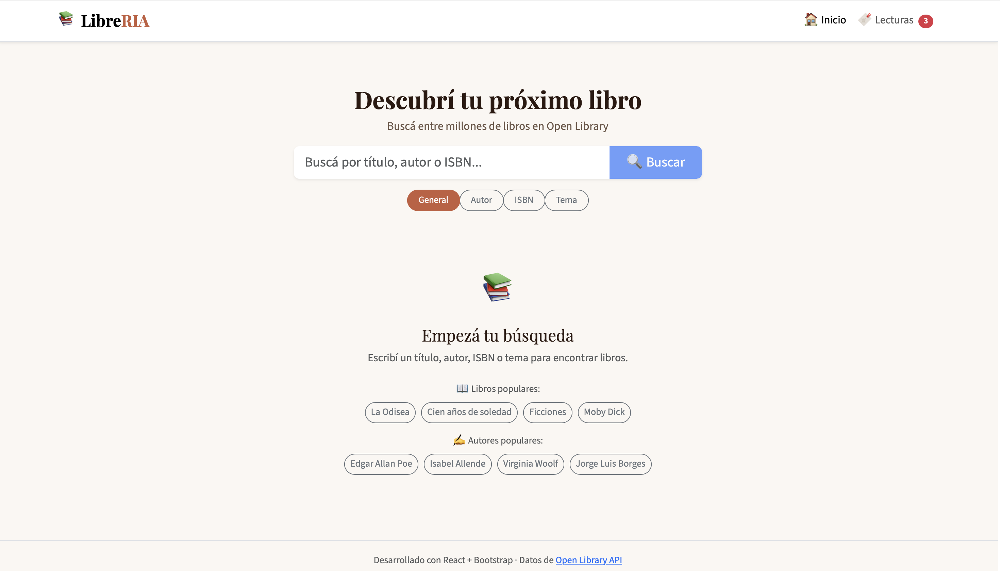
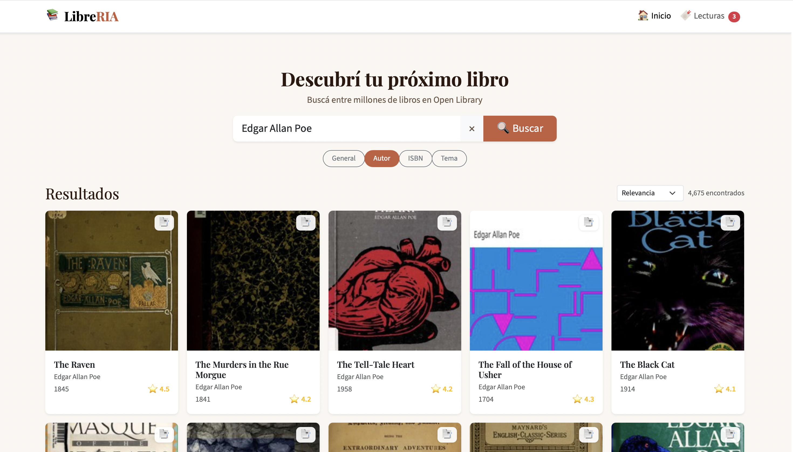
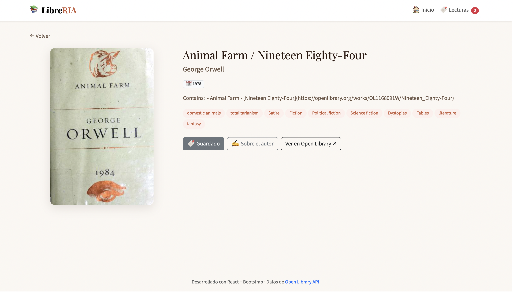
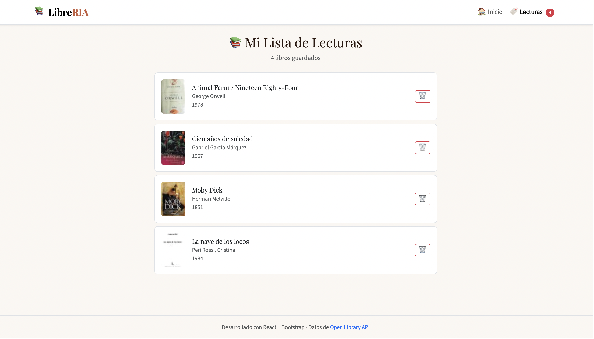
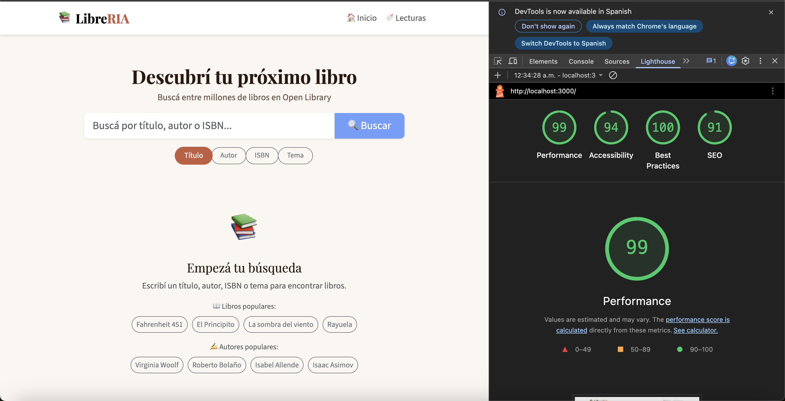

# 📚 LibreRIA — Buscador de Libros

Aplicación RIA para buscar libros usando la [Open Library API](https://openlibrary.org/developers/api). Permite buscar por título, autor, ISBN o tema, navegar resultados paginados, revisar el detalle de cada obra y guardar una lista de lectura persistida en `localStorage`.

**Curso:** Rich Internet Applications (RIA) 2026  
**Tarea:** Laboratorio 2 — Escenario #6: Buscador de Libros  
**Repositorio:** https://github.com/joakol119/bookfinder  
**Integrantes:** Joaquín Poblete y Roibeth García

---

## Objetivo

Construir una Single Page Application orientada a búsqueda de libros, con foco en:

- separación entre UI, routing y servicios
- consumo eficiente de API pública
- persistencia local para la lista de lectura
- experiencia responsive para desktop y mobile
- cobertura de pruebas sobre piezas críticas

---

## Tecnologías

| Categoría | Tecnología |
| --- | --- |
| Framework | React 19 + Vite |
| UI | React-Bootstrap 2 + Bootstrap 5 |
| Routing | React Router DOM 7 |
| API | Open Library API |
| Persistencia | LocalStorage |
| Testing | Vitest + React Testing Library |
| Deploy | Docker + Nginx |

---

## Decisiones técnicas destacadas

- **Servicios separados de los componentes** para aislar la lógica de acceso a datos.
- **Paginación de resultados** para evitar renderizados excesivos y mejorar navegación.
- **Caché con TTL** para reducir llamadas repetidas a la API.
- **Filtrado de campos del payload** para traer solo la información necesaria.
- **Lista de lectura persistida** en `localStorage` para mantener estado entre sesiones.

---

## Estructura del proyecto

```text
bookfinder/
├── src/
│   ├── components/        # Componentes reutilizables
│   ├── router/            # Configuración de rutas
│   ├── services/          # API y lógica de datos
│   ├── views/             # Páginas principales
│   ├── App.jsx
│   ├── App.css
│   └── main.jsx
├── tests/                 # Pruebas unitarias e integración
├── docker/                # Dockerfile y configuración de Nginx
├── prompts/               # Registro de uso de IA
├── Capturas/              # Evidencia visual desktop, mobile y diagramas
├── docker-compose.yml
└── README.md
```

---

## Funcionalidades

- búsqueda por título, autor, ISBN y tema
- paginación de resultados
- vista de detalle de cada libro
- lista de lectura persistida en `localStorage`
- interfaz responsive para mobile y desktop

---

## Rutas

| Ruta | Descripción |
| --- | --- |
| `/` | Página principal con buscador |
| `/book/:workId` | Detalle de una obra |
| `/reading-list` | Lista de lecturas pendientes |

---

## API consumida

- **Búsqueda:** `GET https://openlibrary.org/search.json?q={query}`
- **Detalle:** `GET https://openlibrary.org/works/{id}.json`
- **Portadas:** `https://covers.openlibrary.org/b/id/{cover_id}-{size}.jpg`

---

## Capturas de la aplicación

### Home — búsqueda vacía


### Resultados de búsqueda


### Detalle de libro


### Lista de lecturas


---

## Lighthouse

Puntajes obtenidos sobre la build de producción (`localhost:3000`):



| Métrica | Puntaje |
| --- | --- |
| Performance | 99 |
| Accessibility | 94 |
| Best Practices | 100 |
| SEO | 91 |

---

## Cómo levantar el proyecto

### Desarrollo local

```bash
npm install
npm run dev
```

La aplicación queda disponible en `http://localhost:5173`.

### Docker

```bash
docker-compose up --build
```

La aplicación queda disponible en `http://localhost:3000`.

---

## Testing

```bash
npm run test
npm run test:coverage
```

Archivos de prueba incluidos:

- `tests/BookCard.test.jsx`
- `tests/PaginationBar.test.jsx`
- `tests/SearchBar.test.jsx`
- `tests/openLibraryApi.test.js`
- `tests/readingListService.test.js`

---

## Uso de inteligencia artificial

Se utilizó IA como herramienta de apoyo para estructuración inicial, generación asistida de componentes y apoyo en organización del desarrollo. Los prompts relevantes quedaron documentados en la carpeta `prompts/`.

---

## PPT y Demo

En la PPT está incluida la demo.

https://docs.google.com/presentation/d/1wqhThJ-E38OJNHN1ZrwGwi3AKtlaCZkf/edit?usp=sharing&ouid=100249998154306957505&rtpof=true&sd=true

---

## Checklist de entregables

- [x] README sin placeholders y con información real del proyecto
- [x] Código fuente versionado en GitHub
- [x] Pruebas automatizadas incluidas en el repositorio
- [x] Capturas y diagramas de apoyo incluidos en el repositorio
- [x] Link del video demo incorporado en este README
- [x] Link o referencia a la PPT incorporada en este README

---

## Licencia

Proyecto académico — RIA 2026.
